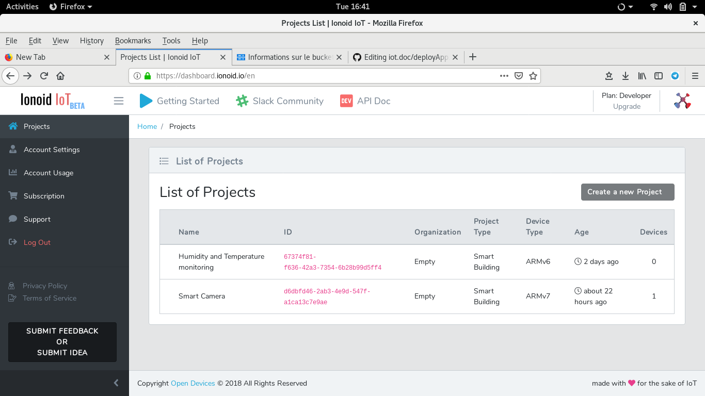
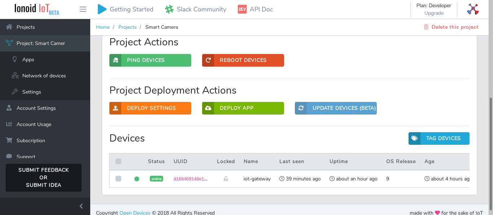
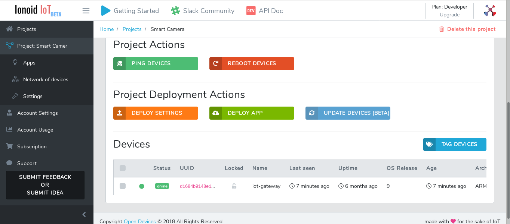
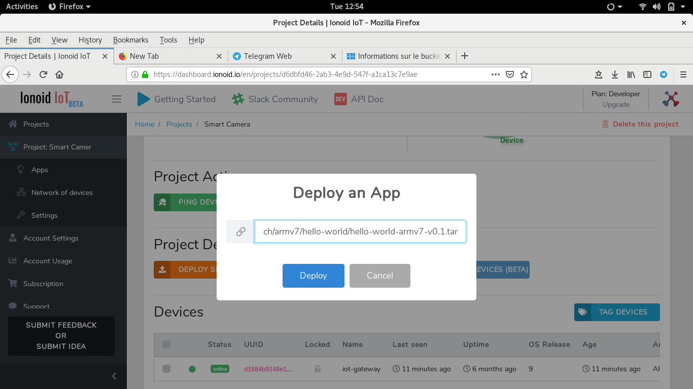
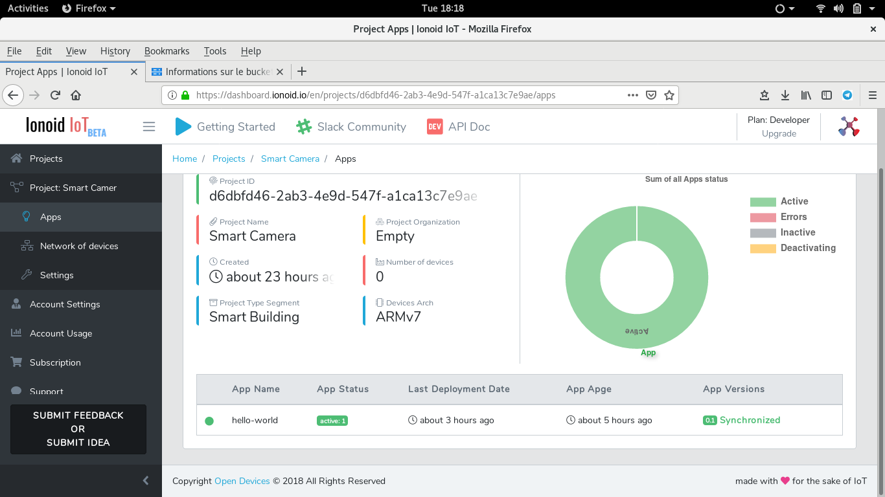
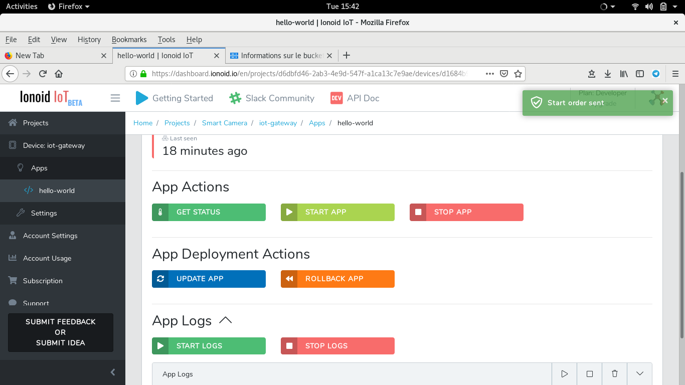

# Deploy IoT Applications using Ionoid IoT Platform.

One of the most interresting features in Ionoid Platform is the **very easy** way to deploy IoT Apps, just in few clicks.

- Connect to your Ionoid account.

- In Project List, click on the project that you want to deploy app on it.

- Go the **Project Deployment Actions** section.

- Click on **Deploy App** button.

- Copy / Paste the URL App from the Appstore your are using an.
- In our example, **hello-world** App we are using the folowing **https://storage.googleapis.com/public.opendevices.io/apps/arch/armv7/hello-world/hello-world-armv7-v0.1.tar**.

- Click on **Deploy**.

- Click on **Apps** in the left menu and see that App status is **active**.

- To run the App click on the App Name, **hello-wolrd** in our example.
- Go to the **App Action** and click on **START APP**. 

--
