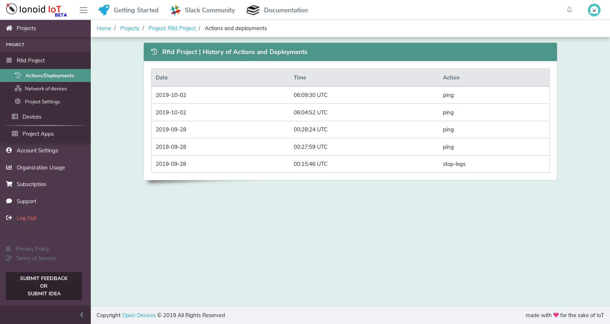

# Monitoring your devices

With ionoid platform, you will be able to monitor actions and operations executed by the platform to your device.

## Devices informations
To make it easy to identify your devices, for each device you have a page dedicated to it, with its name, ip and os
with other timing information like its uptime(time it's been powerd on) time of its last connection and more.

## Actions log
Every action you execute in your device will be displayed at first in the right bloc of your project page if you intend to
execute the command to all your device or the right block of your device if your are on your device detail page.

You can also find history of all executed commands in your project from action/Deployement link in leftside panel of your page

## System log directly from device
The platfom offer a way to see excatly what is happening inside your device in realtime with your device log (system log) directly
displayed on your device page, the option can be activated on the bottom page of device detail "Device Logs", you have the possibility of
activating or stoping log displaying.

---

### Questions?
We're always happy to help with IoT Projects or other questions you might have! Check our [documentation](https://docs.ionoid.io/#/), contact support: support@ionoid.io, or connect with our sales team: sales@opendevices.io. You can also chat live with other developers in  [#slack](https://ionoidcommunity.slack.com/join/shared_invite/enQtODAzODgwOTIyMDY4LWExNWVmMDJhMDE2YWYyMjE3N2FlOGNlZjM4NDlmYmM5MmNhYWY1ZTZmOWMwYTYxYTMxNTQzODYzYmRmODMzOWI).
