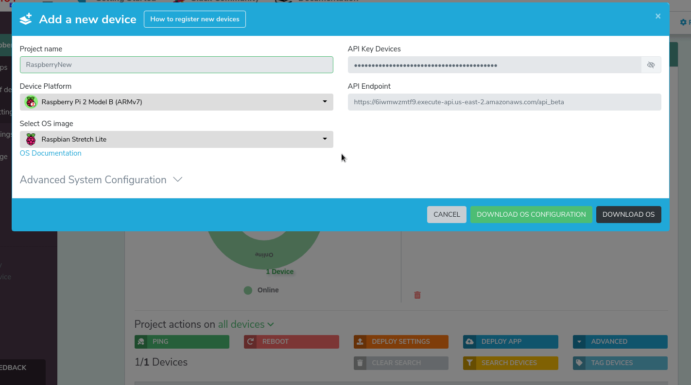
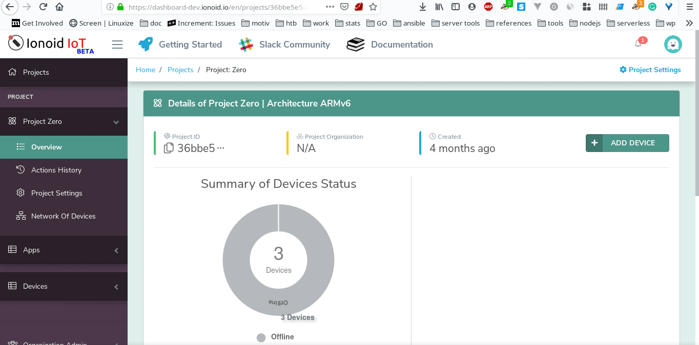
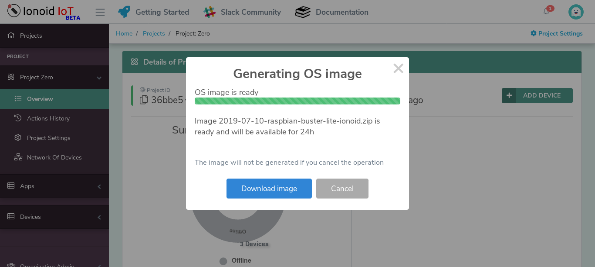
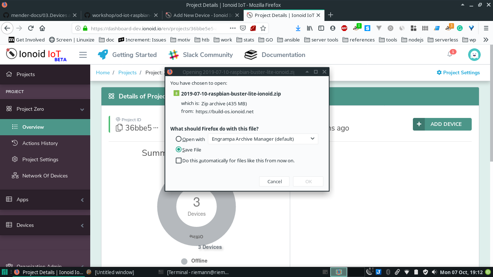

# Add a new device to your IoT Project

To add devices to your project please follow this tutorial.

## Supported Operating Systems

Ionoid uses Linux-IoT Operating Systems and supports multiple
flavors. For each new registered device you can chose or set its
Operating System. The [Supported Boards Table](https://docs.ionoid.io/#/../NewProject/newProject?id=supported-boards-and-operating-systems-table)

More OSs will be added soon.


## Add new device

Click on **Add device**.
 


The displayed fields are part of your Project configuration and they are
**Private do not share them with untrusted parties.**


## General settings

To customize your project or device configuation, click on **Advanced System Configuration**.

 - Set or modify device hostname. Here it is possible to append an asterisk as a suffix to the name (e.g. device-\*) if you want a random id at the end. Example hostname: `device-*` will be `device-2153`. This is useful in case you want to use the same configuration on a fleet of devices.
 - Set or modify DNS servers.
 - Set or modify NTP servers.


## Network settings

You can configure easily your WiFi settings by:

 - Go to  **Network Settings** section.
 - Enable WiFi by clicking on **On** button.
 - Enter your WiFi SSID and password.
 - Select a security option.
 - For development: it is strongly recommended that you set a second Wifi as a fallback,
 in case there are some errors. Maybe use your `phone wireless` as a second
 Wifi.




## Build Linux-IoT OS

Once you finish settings configuration, you can make them the default settings for this Project, click on **SAVE AS DEFAULT SETTINGS** button.

To Generate your Custome Linux-IoT OS there are two methodes:

   1) Beginners: build your Linux-IoT OS
   2) Advanced Linux Users and IoT Developers


### Build OS: Beginners - Linux-IoT (Method 1)

This is the easiest method, especially if you do not have Linux skills
or if you are deploying to a new fresh device.

We will use `Ionoid Build OS` Service to build and prepare our Operating
System. At the end of the operation a link to download the produced
Operating System will be provided to you.

**Security: please keep in mind that the generated OS contains your
Project credentials and secrets, do not share your OS with untrusted
parties.**


#### Build OS: Beginners Step 1

After finishing system configration, click on **DOWNLOAD OS** to start `Ionoid Build OS` Service. If you are a little thursty after all those effort it is time to take coffee, `Build OS` will take some time between 40secs to 2mins to finish.



The build progress will update you on the operation, your newly
generated and **PRIVATE** OS includes your configuration, project
secrets, keys, and the necessary tools to manager your device from
Ionoid Dashboard.




#### Build OS: Beginners Step 2

Click on **Download OS Image** to start downloading you new OS



Congratulation, your OS is now ready to be burned to your device storage.


### Build OS: Advanced Linux Users - Linux-IoT (Method 2)

This is the advanced method for Linux users that want to build their own OS.


#### Build OS: Advanced Linux Users Step 1


After finishing configuration settings, click on **Download OS Configuration**, the dashboard will generate a private **config.json** file that contains your device settings.


**Security: please keep in mind that the config.json file contains your Project credentials and secrets, do not share your OS with untrusted parties.**


#### Build OS: Advanced Linux Users Step 2

Now download your Operating System image, check the following to find the links:

- [Raspbian OS Images](https://www.raspberrypi.org/downloads/raspbian/)
- More OSs will be added soon.


#### Build OS: Advanced Linux Users Step 3

Assuming that all goes well which should be the case, create a working direcotry.

```bash
mkdir -p ionoid-build
```

Copy your downloaded Operating System image and `config.json` files into `ionoid-build`
directory.

Example:
`2018-06-27-raspbian-stretch-lite.zip`

`config.json`


To generate your Linux-IoT system run the following commands, and when
prompted for `root` password, enter it, it will allow to mount the OS image
configure it and install the necessary software.

The build process needs at least extra packages, make sure to install
them:

- jq: (Command-line JSON processor)
- kpartx: (Create device maps from partition tables)


```bash
cd ionoid-build
curl https://manager.services.ionoid.net/install-tools.bash | IMAGE=2018-11-13-raspbian-stretch-lite.zip CONFIG=config.json bash

```

Once the build process finished you should find the new patched image inside the `output`
directory:
`./output/2018-06-27-raspbian-stretch-lite-ionoid.zip`


Now burn the generated `zip image` into your MicroSD card. You can use
[Etcher](https://etcher.io/) to copy the `zip image`.


After that, boot your device and go to your project in [Ionoid Dashboard](https://dashboard.ionoid.io), it should take some minutes before the device auto shows up there.


Congratulations!


---


### Questions?
We're always happy to help with IoT Projects or other questions you might have! Check our [documentation](https://docs.ionoid.io/#/), contact support: support@ionoid.io, or connect with our sales team: sales@opendevices.io. You can also chat live with other developers in  [#slack](https://ionoidcommunity.slack.com/join/shared_invite/enQtNTAzMTEwMTc5NDc2LTM2ODgxY2VmYTljNjM2NTNmZmVjYTEzY2Q4NTgyZTljYzI3MzhiZGRlODkzNTE3NTE3ODk5ZmFjNjYzOGRjZTM).
