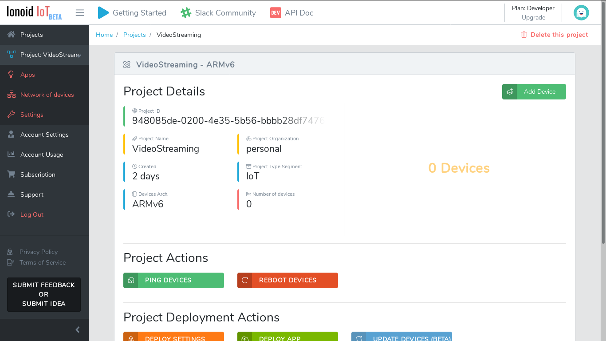
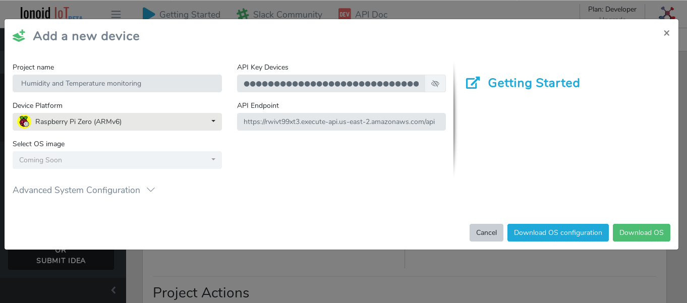
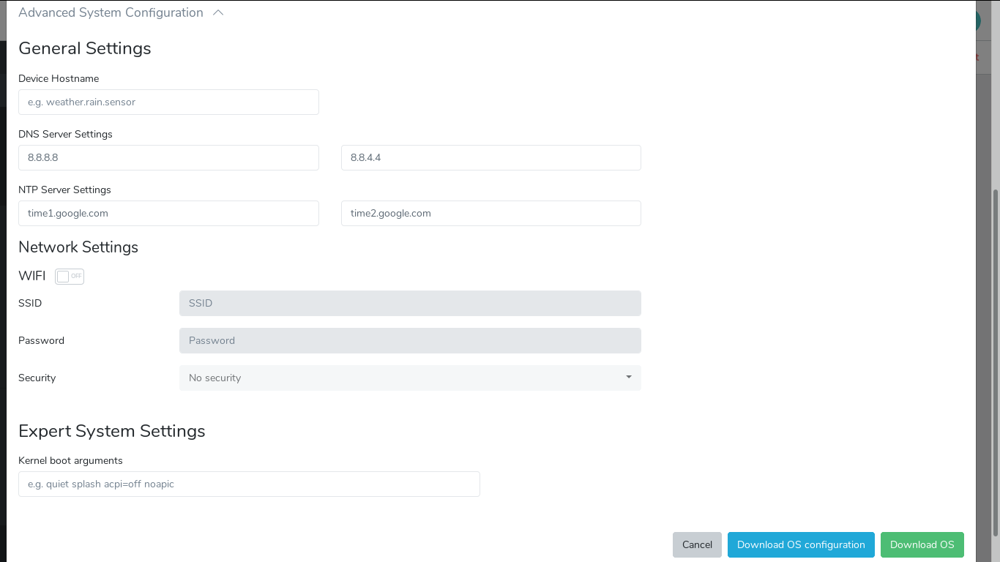
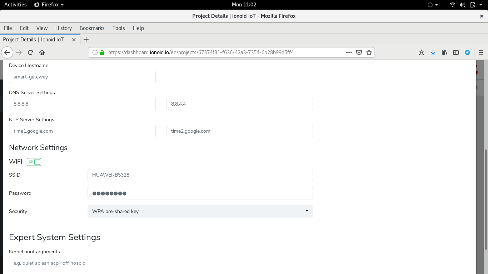
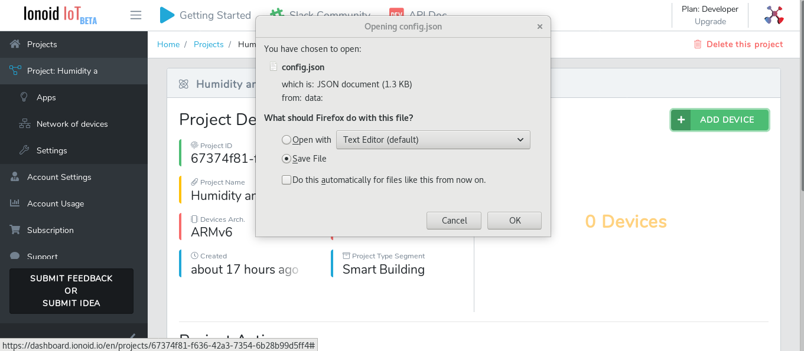

<nav role="navigation">
                <ul class="pagination">
                        <li class="button"><a href="#0">Prev</a></li>
                        <li class="button"><a href="#0">Next</a></li>
                </ul>
</nav>

# Add a new device to your

Once you create a project on Ionoid IoT platform, you can now add devices to
the project.

## Add new device

  Click on **Add device** button to add a new device to the project.
 
 
 
 Click on **Advanced System Configuration** to customize system device configuration.
 
 

## General settings

You can set or modify  the configuration of your device system  easily using dashboard.
 - Set or modify  a hostname.
 - Set or modify a DNS server.
 - Set or modify a NTP server.

## Network settings

  You can configure easily your  WiFi connection.

 - Go to  **Network Settings** section.
 - Enable WiFi by clicking on **On** button.
 - Enter your WiFi SSID and password.
 - Select a security option.

## Download OS configuration file.

Once you have finished setting your system, the dashboard will generate a file named **config.json** that contain the whole configuration of your device.

The **config.json** file sould be saved in a secure place and do not share it, because it contain sensitive information and you can compromise the security of your device.

---

<ul class="doclink">                                                                                                                                                                             
  <li><a href="https://docs.ionoid.io/#/../DeployApp/deployApp.md"> Deploy Apps </a></li>
  <li> <a href="https://docs.ionoid.io/#/../UpdateApp/updateApp.md">Update Apps </a> </li>
  <li><a href="https://docs.ionoid.io/#/../RollbackApp/rollbackApp.md"> Rollback Apps </a></li>                                                                                                                                                          
</ul>

---

### Questions?
We're always happy to help with code or other questions you might have! [Search](https://docs.ionoid.io/#/) our documentation, [contact support](support@ionoid.io), or [connect with our sales team](support@opendevices.io). You can also chat live with other developers in  [#slack](https://ionoidcommunity.slack.com/messages).
