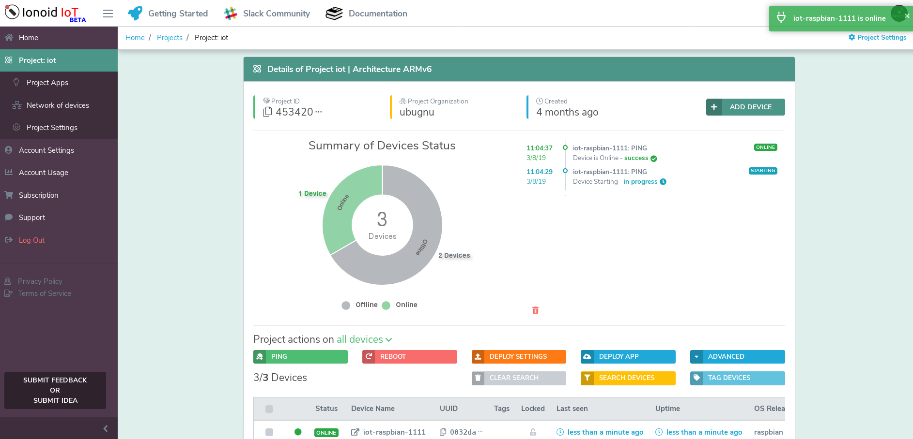

# Add a new device to your IoT Project

Once you create a project, you can start adding devices by following the
this tutorial.


## Add new device

Click on **Add device** button to add a new device to the project.
 

 
Click on **Advanced System Configuration** to customize system device configuration.
 


## General settings

You can set or modify  the configuration of your device system  easily using dashboard.
 - Set or modify device hostname. Here it is possible to append an asterisk as a suffix to the name (e.g. device-\*) if you want a random id at the end. Example hostname: `device-*` will be `device-2153`.
 - Set or modify DNS servers.
 - Set or modify NTP servers.


## Network settings

You can configure easily your WiFi settings by:

 - Go to  **Network Settings** section.
 - Enable WiFi by clicking on **On** button.
 - Enter your WiFi SSID and password.
 - Select a security option.


## Generate Linux-IoT OS

Once you have finished configuration settings, follow up by preparing your Linux-IoT system.

Currently Ionoid IoT supports only [Raspbian OS](https://www.raspberrypi.org/downloads/raspbian/). More OSs will be added soon.


### Beginners - Generate your Linux-IoT OS

To be added soon.


### Advanced Linux Users - Generate Linux-IoT OS

After finishing configuration settings, click on `Download OS Configuration` button, the dashboard will generate a **config.json** file that contains your device settings.


The **config.json** file must be saved in your home directory or in a secure place, do **not share it**. It contains sensitive information about your device's security.


After that, go ahead and download your Rasbpian image, you can find the latest version [here Raspbian image](https://www.raspberrypi.org/downloads/raspbian/)


Assuming that all goes well which should be the case, create a working
direcotry.

```bash
mkdir -p ionoid-build
```

Copy `raspbian` zipped image and `config.json` files into `ionoid-build`
directory.

`2018-06-27-raspbian-stretch-lite.zip`

`config.json`


To generate your Linux-IoT system run the following commands, and when
prompted for `root` password, enter it, it will allow to mount the image
patch it and unmount it.

If your target board is an ARMv7 like the Raspberry PI 3, then set
`MACHINE` environment variable to `arm7` like this:
`MACHINE=arm7`. For a Raspberry PI Zero use `MACHINE=arm6`.


```bash
cd ionoid-build
curl https://manager.services.ionoid.net/install-tools.bash | MACHINE=arm7 IMAGE=2018-06-27-raspbian-stretch-lite.zip CONFIG=config.json bash

```

Once finished you should find the new patched image inside the `output`
directory:
`./output/2018-06-27-raspbian-stretch-lite.zip`


Now burn the generated `zip image` into your MicroSD card. You can use
[Etcher](https://etcher.io/) to copy the `zip image`.


After that, boot your device and go to your project in [Ionoid Dashboard](https://dashboard.ionoid.io), it should take some minutes before the device auto shows up there.




Congratulations!


---


### Questions?
We're always happy to help with IoT Projects or other questions you might have! Check our [documentation](https://docs.ionoid.io/#/), contact support: support@ionoid.io, or connect with our sales team: sales@opendevices.io. You can also chat live with other developers in  [#slack](https://ionoidcommunity.slack.com/join/shared_invite/enQtNTAzMTEwMTc5NDc2LTM2ODgxY2VmYTljNjM2NTNmZmVjYTEzY2Q4NTgyZTljYzI3MzhiZGRlODkzNTE3NTE3ODk5ZmFjNjYzOGRjZTM).
