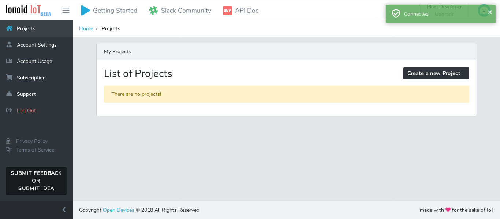
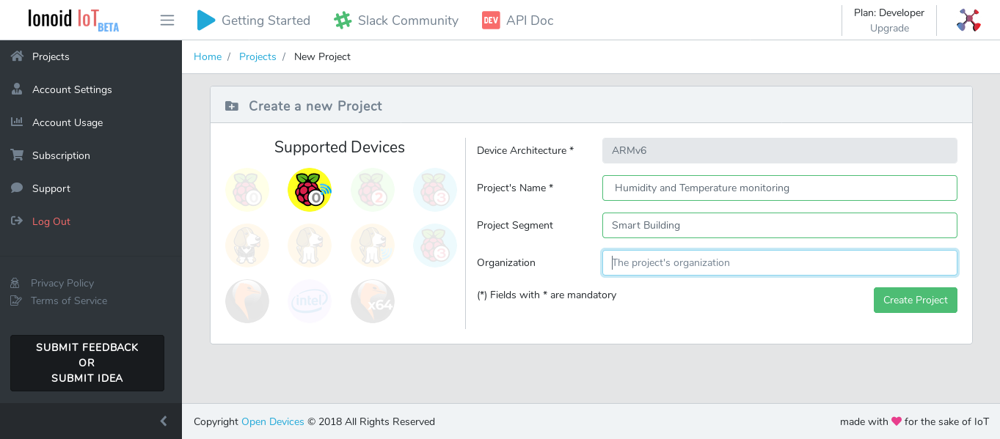
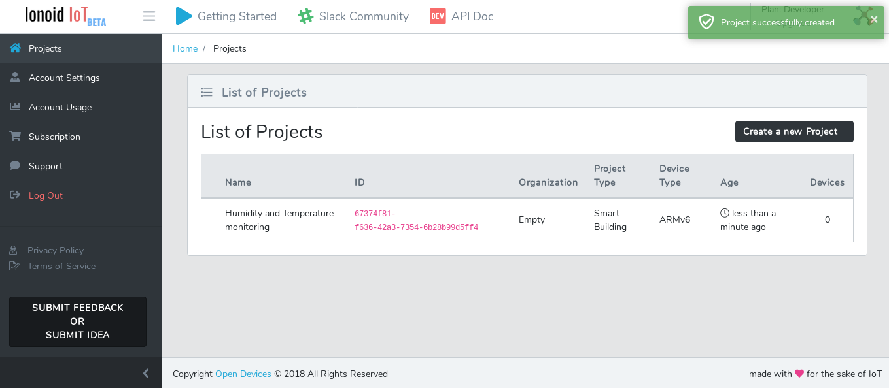
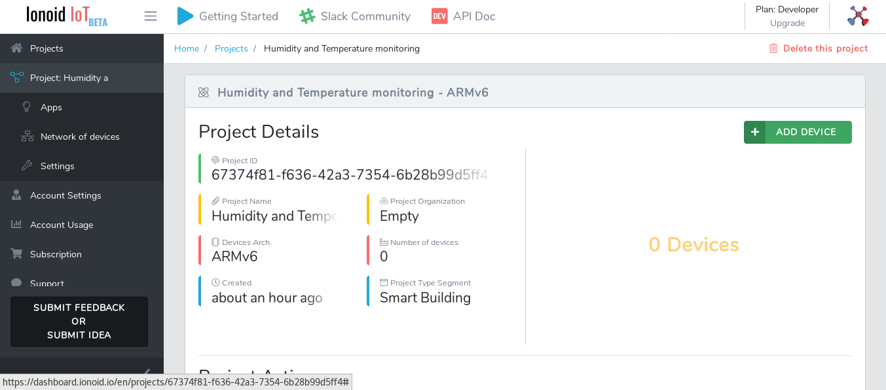

<nav role="navigation">
                <ul class="pagination">
                        <li class="button"><a href="#0">Prev</a></li>
                        <li class="button"><a href="#0">Next</a></li>
                </ul>
</nav>

# Create a new project
To create a new IoT project using Ionoid plaform, sign into your Ionoid account.

## New project
- Click on **Create new project** button.

- On the left you will see all the boards supported by **Ionoid** platform.

- Choose the board your are working on, for exemple **Raspberry Pi Zero** by clicking on the board icon.
- Complete the form with the information related to your project.

- Click on **Create Project** to confirm.

## Entering the Project.

Once you finish to create a new project you will see the list of all the
project you have created and you can access to any project by clicking on
project id.

- You can now  **Add new device** to your IoT project.

---

                                                                                                                                                                            
 <ul class="doclink">                                                                                                                                                          
  <li> <a href="https://docs.ionoid.io/#/../NewDevice/newDevice.md">Add New Device </a> </li> 
  <li><a href="https://docs.ionoid.io/#/../DeployApp/deployApp.md"> Deploy Apps </a></li>
  <li> <a href="https://docs.ionoid.io/#/../UpdateApp/updateApp.md">Update Apps </a> </li>
  <li><a href="https://docs.ionoid.io/#/../RollbackApp/rollbackApp.md"> Rollback Apps </a></li>                                                                                                                                                          
</ul>

---

### Questions?
We're always happy to help with code or other questions you might have! [Search](https://docs.ionoid.io/#/) our documentation, [contact support](support@ionoid.io), or [connect with our sales team](support@opendevices.io). You can also chat live with other developers in  [#slack](https://ionoidcommunity.slack.com/messages).
