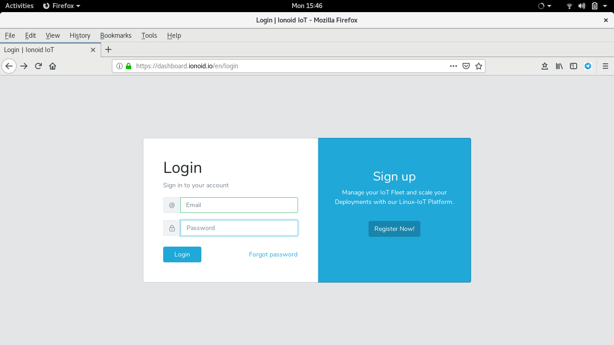
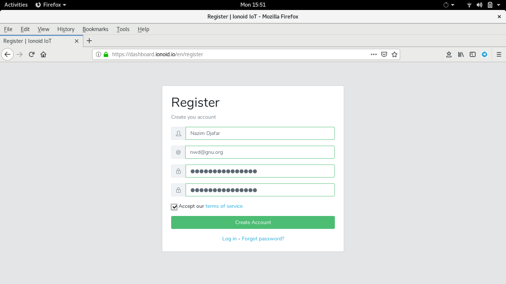
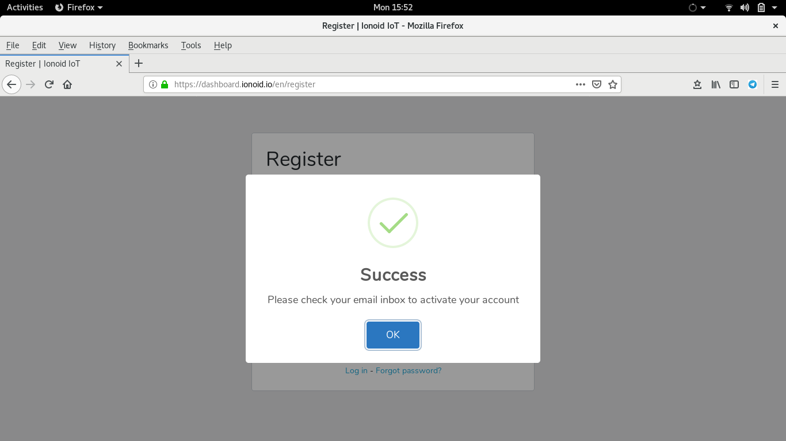
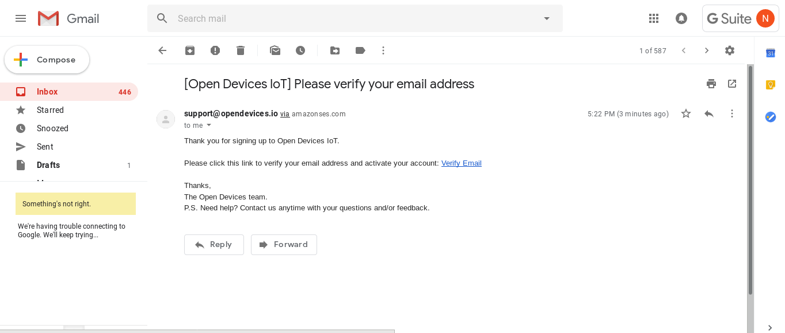
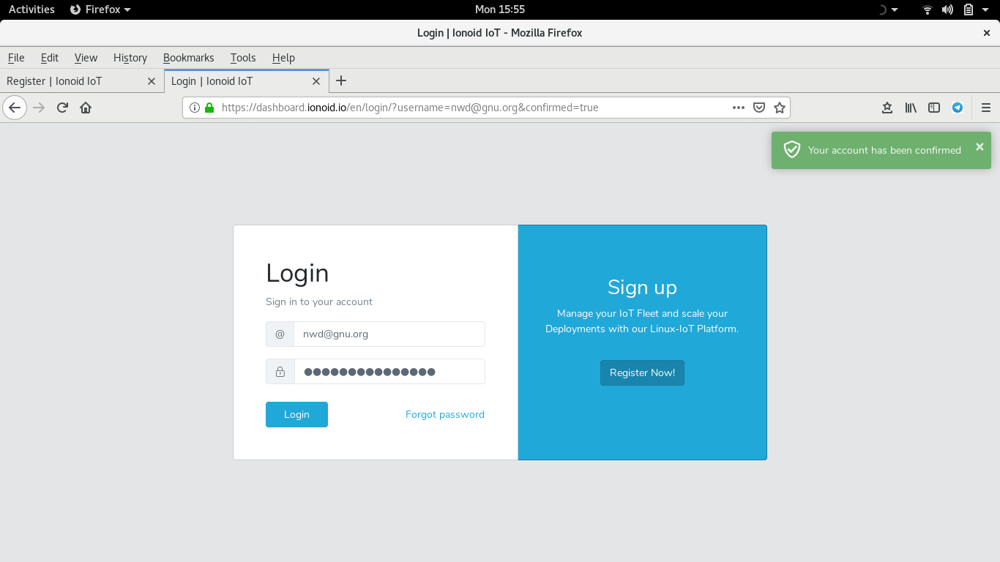
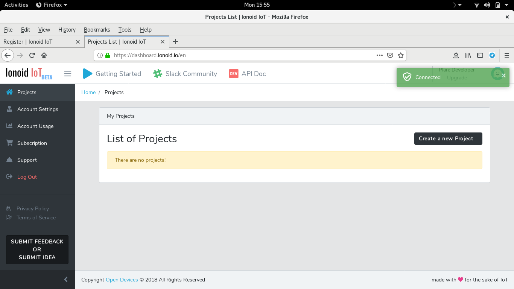

# Create an account on Ionoid IoT platform.

To use Ionoid IoT platform, you will need to create an account.
you can access many Ionoid IoT platform features including

- Monitoring your IoT devices.
- Deploy IoT  Application easily, and more.

You can create an account on Ionoid IoT platform in few easy steps, follow the instructions below.

##  Connect to the Ionoid  IoT dashboard.

- Go to  [Ionoid](https://dashboard.ionoid.io) web site.
- In right, Sing up click on **Register now**.

##  Register

- Fill out the form.
- Accept term of service.
- Click on **Create account**.

## Connect to your Ionoid account

Once you registered and create account, you have to check your email to activate your account.

- Connect to your email.
- Notice an email **Open Devices IoT** from **support@opendevices.io**.

- Click on **Verify Email** to activate your account.
- The link will automatically logs you into your **ionoid** account.

#  Login , sing into

When you sign into your account , you can take advantage of many features.

--

