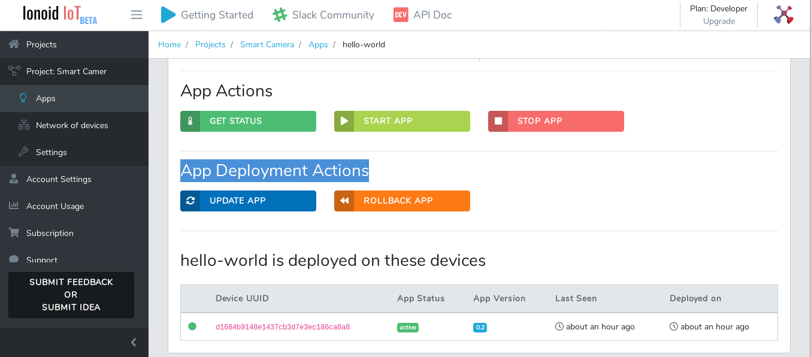
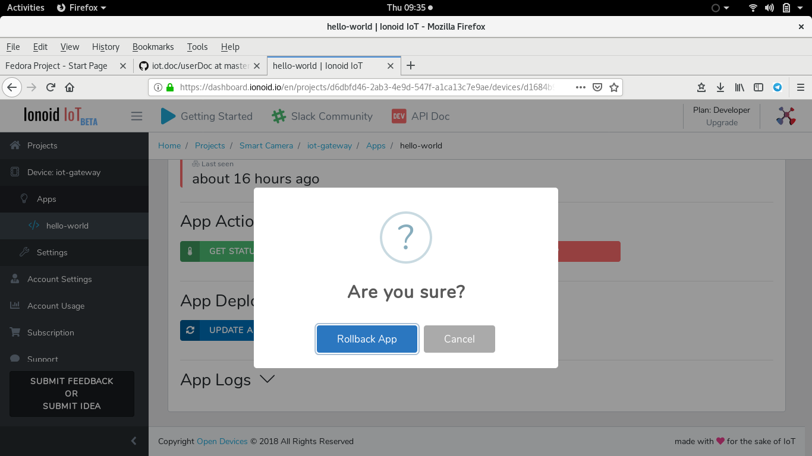

# Rollback your IoT App.

Often when you do an App update , you may dislike the new version features or it maybe a buggy and                                                                          
you prefer to go back to the previous App version, Inoid Platoform offre you very simple way to do that,  **RollBack** feature.                                                                    
                                                                                                                              
- Go to  **App Deployment Actions** section.  

- click on **ROLLBACK APP** button.                                                                                                                                                              
- Confirm by clicking on Rollback App button.

<ul class="pagination">
	<li class="button ">
	  <a class="disabled" href="#0">Prev</a>
	</li>

 <li class="button">
	  <a href="#0">Next</a>
 </li>
</ul> 

---

<ul class="doclink">                                                                                                                                                                                                      
  <li><a href="https://docs.ionoid.io/#/../DeployApp/deployApp.md"> Deploy Apps </a></li>
  <li><a href="https://docs.ionoid.io/#/../UpdateApp/updateApp.md"> Update Apps </a></li>
</ul>

---

### Questions?
We're always happy to help with code or other questions you might have! [Search](https://docs.ionoid.io/#/) our documentation, [contact support](support@ionoid.io), or [connect with our sales team](support@opendevices.io). You can also chat live with other developers in  [#slack](https://ionoidcommunity.slack.com/messages).

