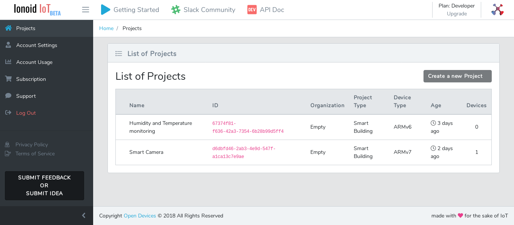
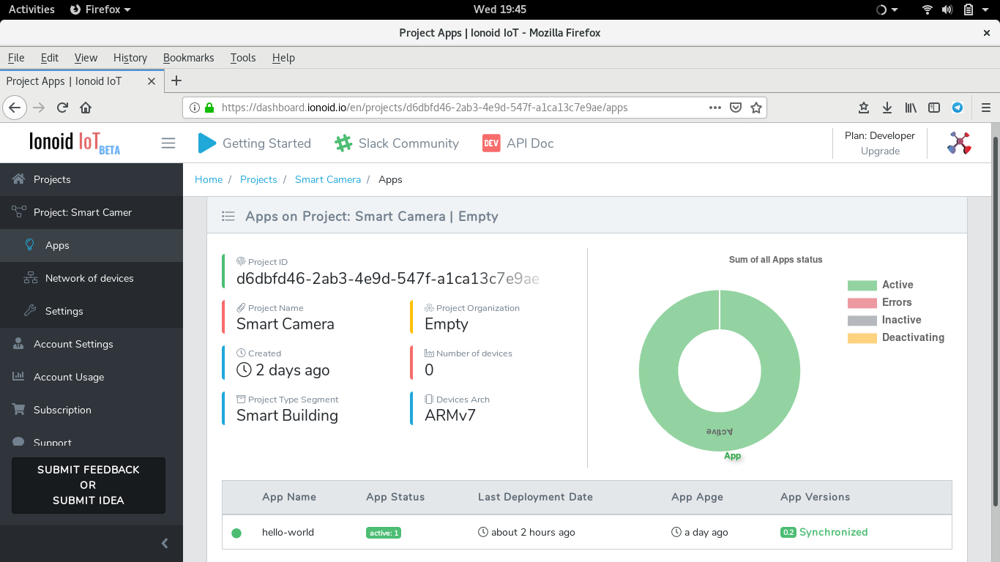
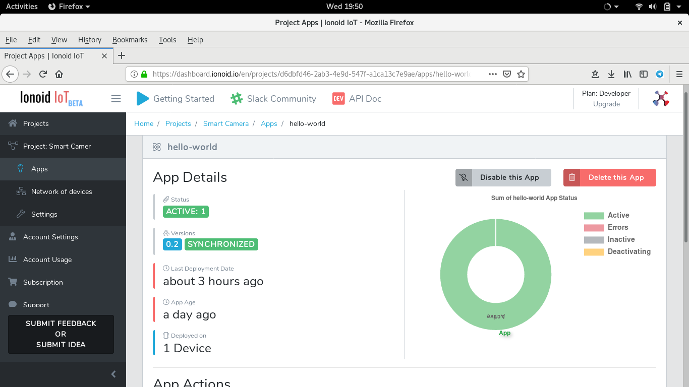
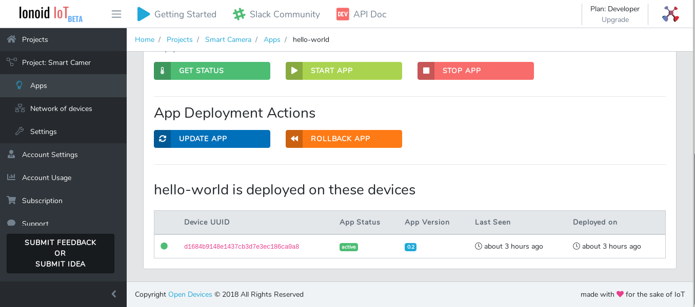
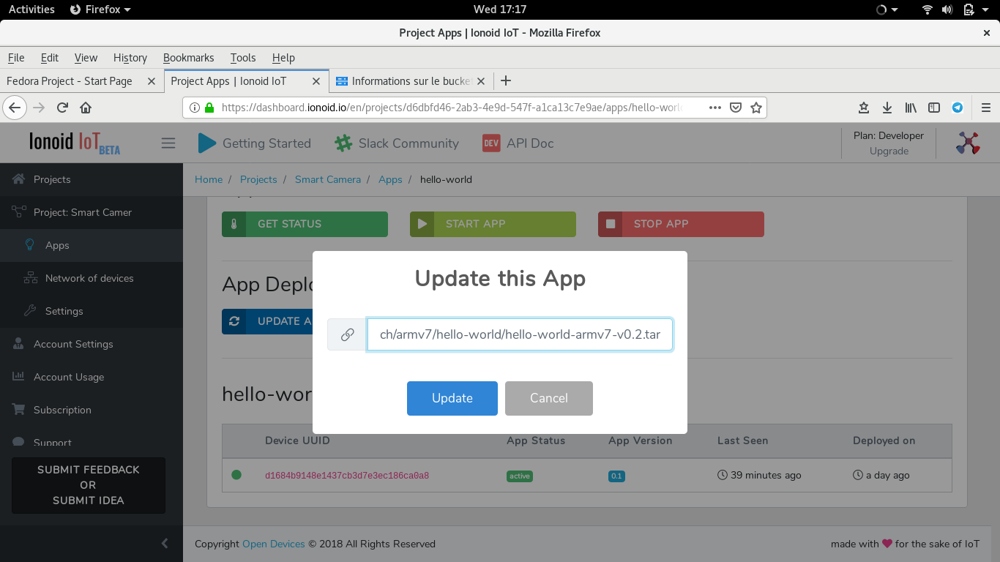

# Update your IoT App using Ionoid Platform.

You can update IoT App  via Ionoid Platform.

- Go to Project list and select the IoT project,  you want to update it's app.
 
 
 
- Click on **Apps** in the left menu to see all apps related to the current IoT project.

 

- Select the App to update by clicking on it's **App Name** , in our exemple **hello-wolrd** app.

 

- Go to **App Deployment Actions** and click on **UPDATE APP** button.

 

- Provide the URL of the new app version,  in our example hello-worldv2 it's.
**https://storage.googleapis.com/public.opendevices.io/apps/arch/armv7/hello-world/hello-world-armv7-v0.2.tar**

 

- Click on the **UPDATE** button.

---

### Questions?
We're always happy to help with IoT Projects or other questions you might have! Check our [documentation](https://docs.ionoid.io/#/), contact support: support@ionoid.io, or connect with our sales team: sales@opendevices.io. You can also chat live with other developers in  [#slack](https://ionoidcommunity.slack.com/join/shared_invite/enQtNTAzMTEwMTc5NDc2LTM2ODgxY2VmYTljNjM2NTNmZmVjYTEzY2Q4NTgyZTljYzI3MzhiZGRlODkzNTE3NTE3ODk5ZmFjNjYzOGRjZTM).
